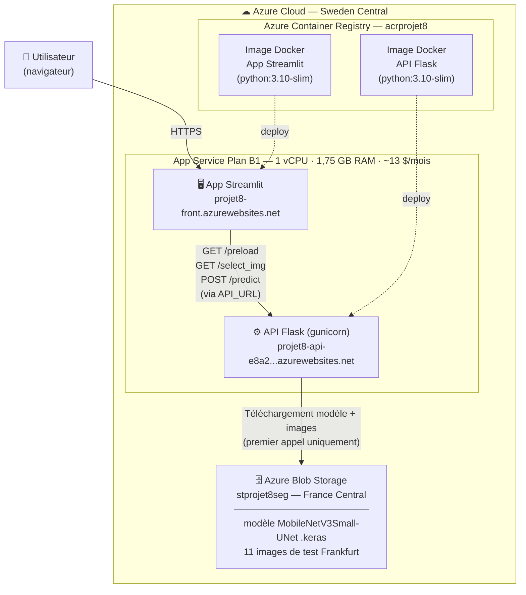

# Architecture de déploiement — Projet 8

## Schéma global



---

## Fonctionnement détaillé

### Flux d'une session utilisateur

```
Utilisateur ouvre l'app Streamlit
        │
        ▼
Streamlit appelle GET /preload  ──── [st.cache_data : résultat mis en cache]
        │                                   │
        │                           API Flask (premier appel) :
        │                           télécharge modèle + images
        │                           depuis Azure Blob Storage
        │                           → charge le modèle en mémoire
        │                           → conservé pour toutes les requêtes suivantes
        │
        ▼
Utilisateur sélectionne une image
        │
        ▼
Streamlit appelle GET /select_img?index=N
        │
        ▼
        API renvoie image originale + masque réel (base64)
        │
        ▼
Utilisateur clique "PREDICT"
        │
        ▼
Streamlit appelle POST /predict  {image_index: N}
        │
        ▼
        API → inférence MobileNetV3Small-UNet (~0,32 sec)
        API renvoie masque prédit (base64)
        │
        ▼
Streamlit affiche :
  image originale | masque réel | masque prédit
  + Modèle : MobileNetV3Small-UNet · Dice = 0.696 · mIoU = 0.661
```

---

## Points techniques clés

| Mécanisme | Explication |
|---|---|
| **Lazy loading** | Le modèle n'est pas chargé au démarrage de l'API — seulement à la première vraie requête. Permet un démarrage instantané sans timeout Azure App Service. |
| **/health endpoint** | Renvoie `{"status": "ok"}` immédiatement, sans charger le modèle. Utilisé par Azure comme sonde de démarrage (startup probe). |
| **st.cache_data** | Mise en cache du résultat de `/preload` côté Streamlit — évite de re-télécharger la liste des images à chaque interaction utilisateur. |
| **API_URL** | Variable d'environnement injectée dans le container Streamlit — permet de changer l'URL de l'API sans modifier le code source (découplage front/API). |

---

## Endpoints de l'API Flask

| Endpoint | Méthode | Description |
|---|---|---|
| `/health` | GET | Sonde de démarrage — renvoie `{"status": "ok"}` instantanément |
| `/preload` | GET | Charge les ressources (modèle + images) et renvoie la liste des images de test |
| `/select_img` | GET | Renvoie image originale + masque réel pour l'index donné (base64) |
| `/predict` | POST | Lance l'inférence et renvoie le masque prédit (base64) |

---

## Environnement local (développement)

```
localhost (Streamlit)   →   localhost:4444 (Flask API)
                                    │
                            modèle local .keras
                            images locales Cityscapes
```

Variable d'environnement `API_URL` : non définie en local → fallback `http://127.0.0.1:4444`

---

## Ressources Azure

| Ressource | Identifiant | Région |
|---|---|---|
| Groupe de ressources | `rg-projet8` | Sweden Central |
| App Service Plan | `ASP-rgprojet8-ba7f` (B1) | Sweden Central |
| Container Registry | `acrprojet8` | — |
| Blob Storage | `stprojet8seg` | France Central |
| App Streamlit | `projet8-front` | Sweden Central |
| API Flask | `projet8-api` | Sweden Central |

### Gestion des crédits Azure

```bash
# Mettre en pause entre les démonstrations
az webapp stop --name projet8-api   --resource-group rg-projet8
az webapp stop --name projet8-front --resource-group rg-projet8

# Redémarrer avant démonstration
az webapp start --name projet8-api   --resource-group rg-projet8
az webapp start --name projet8-front --resource-group rg-projet8
```

---

*Architecture déployée — Juillet 2026*
